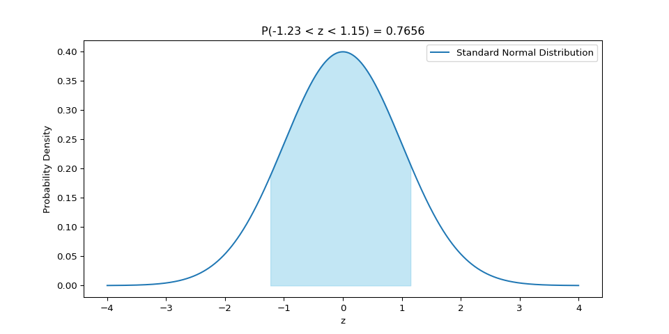
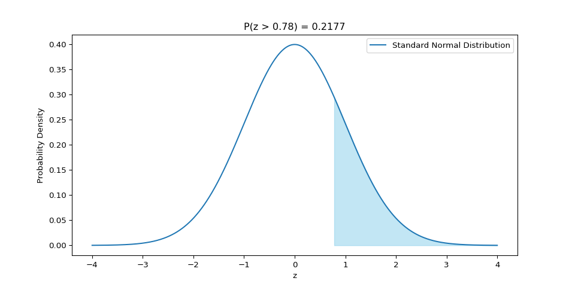
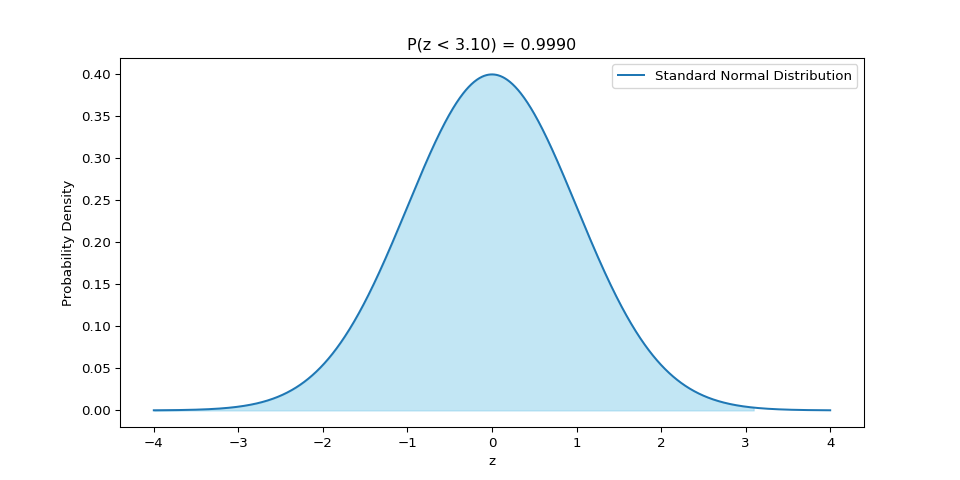

# Math 210 – Assignment 2 B (Statistics)

## Question 1

At a certain college, 3% of students do not use the college Gym. If a
random sample of 12 students is selected, calculate: ***Express your
answers correct to 4 decimal places.***

<!-- -->

a\) The probability that exactly 3 of them will not use the college Gym.
\[3 marks\]

b\) At least 2 will not use the college Gym. \[4 marks\]

c\) The mean for the probability distribution \[1 mark\]

d\) The standard deviation for the probability distribution \[1 mark\]

<!-- -->

- $n = 12$
- $p = 0.03$

$$ P(X = k) = C_{n}^{k} p^k (1-p)^{n-k} $$

### a) The probability that exactly 3 of them will not use the college Gym. \[3 marks\]

$$ P(X = 3) = C_{12}^{3} (0.03)^3 (0.97)^9 \approx 0.0045 $$

### b) At least 2 will not use the college Gym. \[4 marks\]

$$
\begin{align}
P(X \geq 2) &= 1 - P(X < 2) \\
&= 1 - [P(X = 0) + P(X = 1)] \\
&= 1 - [ C_{12}^{0} (0.03)^0 (0.97)^{12} + C_{12}^{1} (0.03)^1 (0.97)^{11} ] \\
&\approx 0.05
\end{align}
$$

### c) The mean for the probability distribution

$$ \mu = n \cdot p = 12 \times 0.03 = 0.36 $$

### d) The standard deviation for the probability distribution

$$ \sigma = \sqrt{n \cdot p \cdot (1 - p)} = \sqrt{12 \times 0.03 \times 0.97} \approx 0.5910 $$

## Question 2

The weights of 12 months old Siamese cats is known to be normally
distributed with a mean of 7.2 lbs and a standard deviation of 1.4 lbs.

<!-- -->

a\) If a Siamese cat is selected at random, what is the probability of
having a weight greater than 7.5 lbs? \[3 marks\]

b\) If a sample of 25 Siamese cats is selected, what is the probability
that their mean weight is between 6.8 lbs and 7.3 lbs? \[4 marks\]

<!-- -->

### a) The probability of a randomly selected Siamese cat weighing more than 7.5 lbs

- $X = 7.5$
- $\mu = 7.2$
- $\sigma = 1.4$

$$ Z = \frac{X - \mu}{\sigma} = \frac{7.5 - 7.2}{1.4} \approx 0.2143 $$

$$ P(X > 7.5) = 1 - P(X \leq 7.5) = 1 - P(Z \leq 0.2143) = 1 - 0.5856 \approx 0.4144 $$

### b) The probability that the mean weight of a sample of 25 Siamese cats is between 6.8 lbs and 7.3 lbs

- $\sigma = 1.4$
- $n = 25$

$$ s = \frac{\sigma}{\sqrt{n}} = \frac{1.4}{\sqrt{25}} = 0.28 $$

$$ Z_{6.8} = \frac{X_{6.8} - \bar{X}}{s} = \frac{6.8 - 7.2}{0.28} \approx -1.4286 $$

$$ Z_{7.3} = \frac{X_{7.3} - \bar{X}}{s} = \frac{7.3 - 7.2}{0.28} \approx 0.3571 $$

$$ P(-1.4286 < Z < 0.3571) = P(Z < 0.3571) - P(Z < -1.4286) = 0.6392 - 0.0764 \approx 0.5628 $$

## Question 3

Find the following **probabilities**. Provide a graph for each case. \[9
marks\]

<!-- -->

a\) *P*(−1.23 \< *z* \< 1.15)

b\) *P*(*z* \> 0.78)

c\) *P*(*z* \< 3.10)

<!-- -->

### a) *P*(−1.23 \< *z* \< 1.15)

### b) *P*(*z* \> 0.78)

### c) *P*(*z* \< 3.10)

## Question 4

A high school wants to estimate the average number of hours per week
their students spend playing sports. They randomly select a sample of 25
students and record the number of hours each student spends playing
sports. The sample has a mean of 4.5 hours per week with a standard
deviation of 1.1 hours per week. Considering a normal distribution,
construct a 90% confidence interval for the mean number of hours per
week that the students at the high school spend playing sports.

<!-- -->

a\) Find the margin of error \[2 marks\]

b\) Find the confidence interval for the population mean \[2 marks\]

<!-- -->

To construct a 90% confidence interval for the mean number of hours per
week that the students at the high school spend playing sports, we will
use the sample mean ($\bar{x} = 4.5$ hours) and the sample standard
deviation ($s = 1.1$ hours). Given that the sample size is $n = 25$, we
assume a normal distribution and use the $t$-distribution because the
sample size is small.

### a) Find the margin of error \[2 marks\]

- $1 - \alpha = 0.9$
- $n = 25$
- $s = 1.1$
- $\bar{x} = 4.5$

$$ \text{ME} = t_{\frac{\alpha}{2}, n-1} \times \frac{s}{\sqrt{n}} = t_{0.05, 24} \times \frac{1.1}{\sqrt{25}} \approx 0.376 $$

### b) Find the confidence interval for the population mean

$$ \text{CI} = \bar{x} \pm \text{ME} = 4.5 \pm 0.376 \approx (4.124, 4.876) $$

## Question 5

A software development team is assessing the performance of a new
feature in a software application. They collected data from a sample of
35 users and recorded the time (in seconds) it took for each user to
complete a specific task. The sample mean completion time was 25
seconds. It is known that the population standard deviation of
completion time is 3.2 seconds. Calculate a 99% confidence interval for
the true mean completion time of all users.

a\) Find the best point estimate for the population mean \[1 mark\]

b\) Find the critical value \[1 mark\]

c\) Find the margin of error (maximum error of estimate) \[2 marks\]

d\) Find the confidence interval \[2 mark\]

To calculate the 99% confidence interval for the true mean completion
time, we will follow these steps:

### a) Find the best point estimate for the population mean \[1 mark\]

$$ \mu \approx \bar{x} = 25 $$

### b) Find the critical value

- $1 - \alpha = 0.99$

$$ z_{\alpha/2} = z_{0.005} \approx 2.576 $$

### c) Find the margin of error (maximum error of estimate)

- $\sigma = 3.2$
- $n = 35$

$$
\text{ME} = z_{\alpha/2} \times \frac{\sigma}{\sqrt{n}} = 2.576 \times \frac{3.2}{\sqrt{35}} \approx 1.3934
$$

### d) Find the confidence interval

$$ \text{CI} = \bar{x} \pm \text{ME} = 25 \pm 1.3934 \approx (23.6068, 26.3932) $$
