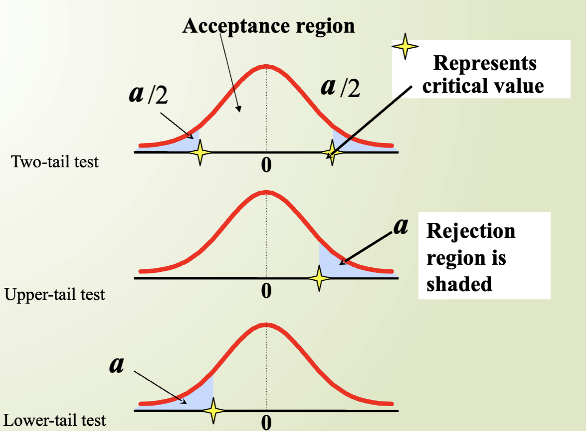

---
output:
  md_document:
    variant: gfm
---

# Hypotheses Testing

## Steps for Hypotheses Testing

In a court of law, there are 2 possible errors:
1. Finding the defendant guilty when he is innocent.
2. Finding the defendant innocent when he is guilty.

In hypothesis testing, these 2 types of errors translate as follows:

1. **Type I error**: The mistake of rejecting the null hypothesis when it is true. For instance, in the above example, rejecting the hypothesis of mean salary being \$45,000 when, in fact, it is true.
2. **Type II error**: The mistake of failing to reject the null hypothesis when it is false. For instance, in the above example, failing to reject the hypothesis of mean salary being \$45,000 when, in reality, it is not true.

#### Type I and II Errors:

The size of \( \alpha \), the rejection region, affects the risk of making different types of incorrect decisions.

- **Type I Error**:
  - Rejecting a true null hypothesis when it should NOT be rejected.
  - Considered a serious type of error.
  - The probability of Type I Error is \( \alpha \).
  - It is also called the level of significance of the test.

- **Type II Error**:
  - Failing to reject a false null hypothesis that should have been rejected.
  - The probability of Type II Error is \( \beta \).

1. Choose \( \alpha \). The value should be small, usually less than 10%. Consider the consequences of both types of errors.
2. Choose the level of significance and determine the critical region by calculating the critical value(s). There are 3 possibilities for the acceptance region:

 

### Two-tail Test
\[
\begin{align*}
H_0: & \ \mu = 12 \\
H_1: & \ \mu \neq 12
\end{align*}
\]

- Acceptance region is between the critical values \(\pm \alpha/2\).

### Upper-tail Test
\[
\begin{align*}
H_0: & \ \mu = 12 \\
H_1: & \ \mu > 12
\end{align*}
\]

- Rejection region is shaded in the upper tail beyond the critical value \(\alpha\).

### Lower-tail Test
\[
\begin{align*}
H_0: & \ \mu = 12 \\
H_1: & \ \mu < 12
\end{align*}
\]

- Rejection region is shaded in the lower tail beyond the critical value \(\alpha\).
