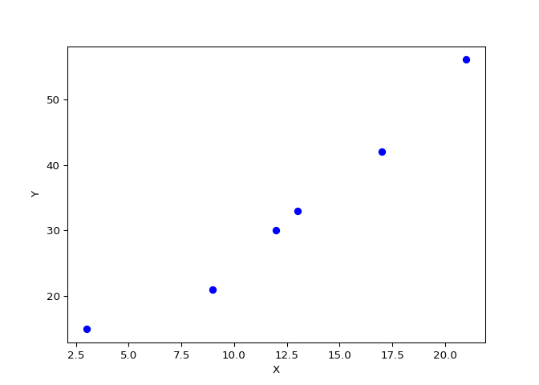

# Math 210 – Assignment 1 B (Statistics)

## Question 1

1\. For the data below, representing a sample of heights (in metres) for
10 years old males at a certain school, find:

Data: 1.3, 1.5, 1.4, 1.3, 1.2, 1.4 **\[8 marks\]**

a\) The mean

b\) The median

c\) The mode

d\) The standard deviation

e\) The 72<sup>nd</sup> percentile

**Solve by hand (without the use of software) and include full
solutions.**

### a) The mean

$$
\begin{align}
\bar{x} = \frac{\sum\limits_{i=1}^{n}x_i}{n} = \frac{1.3 + 1.5 + 1.4 + 1.3 + 1.2 + 1.4}{6} = 1.35
\end{align}
$$

### b) The median

Sort: 1.2, 1.3, 1.3, 1.4, 1.4, 1.5

$$
\begin{align}
\text{Median} = \frac{1.3 + 1.4}{2} = 1.35
\end{align}
$$

### c) The mode

Both 1.3 and 1.4 appear twice so the data set is bimodal with modes of
1.3 and 1.4.

### d) The standard deviation

$$
\begin{align}
s &= \sqrt{\dfrac{\sum\limits_{i=1}^{n} (x_i - \bar{x})^2}{n-1}} \\
&= \sqrt{\dfrac{(1.3 - 1.35)^2 + (1.5 - 1.35)^2 + (1.4 - 1.35)^2 + (1.3 - 1.35)^2 + (1.2 - 1.35)^2 + (1.4 - 1.35)^2}{6-1}} \\
&\approx 0.105
\end{align}
$$

### e) The 72<sup>nd</sup> percentile

- Sort: 1.2, 1.3, 1.3, 1.4, 1.4, 1.5

$$
\frac{72}{100} \times 6 = 4.32 \rightarrow \text{Loc} P_{72} = 5 \rightarrow P_{72} = 1.4
$$

## Question 2

2\. The following frequency table represents the distribution of the
ages of participants in a bike competition:

| Age Group - Classes | Frequency | Class boundaries | Relative frequency |
|---------------------|-----------|------------------|--------------------|
| 20 - 24             | 75        |                  |                    |
| 25 - 29             | 65        |                  |                    |
| 30 - 34             | 60        |                  |                    |
| 35 - 39             | 55        |                  |                    |
| 40 - 44             | 45        |                  |                    |
| Total               |           |                  |                    |

Find: **\[4 marks\]**

1.  The class width
2.  The number of participants in the study
3.  The class boundaries for the **second class**
4.  The relative frequency for the **fourth class**

**Solve by hand (without the use of software) and include full
solutions.**

### 0. Frequency table

| Age Group (Classes) | Frequency |
|---------------------|-----------|
| 20 - 24             | 75        |
| 25 - 29             | 65        |
| 30 - 34             | 60        |
| 35 - 39             | 55        |
| 40 - 44             | 45        |
| **Total**           | **300**   |

### 1. The class width

$$\text{Class width} = 25 - 20 = 5$$

### 2. The number of participants in the study

$$\text{Number of Participants} = 75 + 65 + 60 + 55 + 45 = 300$$

### 3. The class boundaries for the second class

| Age Group (Classes) | Frequency |
|---------------------|-----------|
| 25 - 29             | 65        |
| 30 - 34             | 60        |

A). Subtract the upper class limit from the next lower class limit and
divide the result by 2: $$\frac{30 - 29}{2} = 0.5$$ B). Add this number
to the upper of the Second Class limit and subtract it from the lower
class limit:

- Lower boundary: $25 - 0.5 = 24.5$
- Upper boundary: $29 + 0.5 = 29.5$

### 4. The relative frequency for the fourth class

| Age Group (Classes) | Frequency |
|---------------------|-----------|
| 35 - 39             | 55        |
| **Total**           | **300**   |

$$\text{Relative frequency} = \frac{\text{Frequency of the class}}{\text{Total frequency}} = \frac{55}{300} \approx 18.33\%$$

## Question 3

3\. The following data represents the ages for a sample of people
swimming at a community centre pool:

4, 20, 23, 7, 23, 17, 27, 28, 47, 49, 23, 18, 34, 43

1.  What is the interquartile range? **3 marks**
2.  Are there any outliers in the data? Perform all necessary
    calculations to justify your answer. Use the method involving the
    interquartile range to identify the outliers (specify if they are
    mild or severe). **3 marks**

**Solve by hand (without the use of software) and include full
solutions.**

### 1. What is the interquartile range?

Sort: 4,7,17,18,20,23,23,23,27,28,34,43,47,49

$$
\frac{25}{100} \times 14 = 3.5 \rightarrow \text{Loc} P_{25} = 4 \rightarrow P_{25} = 18 \rightarrow Q_1 = 18
$$

$$
\frac{75}{100} \times 14 = 10.5 \rightarrow \text{Loc} P_{75} = 11 \rightarrow P_{75} = 34 \rightarrow Q_3 = 34
$$

$$ IQR = Q_3 - Q_1 = 34−18=16$$

### 2. Are there any outliers in the data?

$$ Q3 + 1.5 \times IQR = 34 + 1.5 \times 16 = 58 $$

$$ Q1 - 1.5 \times IQR = 18 - 1.5 \times 16 = -6 $$

Mild outliers: (-6, 58)

Since the minimum value (4) and the maximum value(49) fall within the
range $[-6, 58]$, there are no mild outliers in this dataset. Since
there are no mild outliers, there are also no severe outliers in this
dataset.

## Question 4

4\. The mean grade for a Statistics class at a certain college is known
to be 78% with a standard deviation of 4.5%.

Find:

a\) The z – score for a grade of 95%. **2 marks**

b\) What is the grade positioned 2.0 standard deviations below the mean?
**2 marks**

**Solve by hand (without the use of software) and include full
solutions.**

### a) The z – score for a grade of 95%.

$$z = \frac{x - \mu}{\sigma} = \frac{95\% - 78\%}{4.5\%} \approx 3.78$$

### b) What is the grade positioned 2.0 standard deviations below the mean?

$$x = \mu + z\sigma = 78\% + (-2.0 \times 4.5\%) = 69\%$$

## Question 5

5\. For the bivariate data below:

| X   | Y   |
|-----|-----|
| 3   | 15  |
| 9   | 21  |
| 12  | 30  |
| 13  | 33  |
| 17  | 42  |
| 21  | 56  |

a\) Draw a scatter plot for the data (***using a Statistical
software***); **2 marks**

b\) Find the equation of the line of best fit. Round off the
coefficients to one decimal place. ***Show all the calculations***. **5
marks**

c\) Redo question b) ***by using Statistical software (include the
output here***). **2 marks**

d)Find the coefficient of correlation. ***Show all the calculations***.
(Epress your answer correct to 2 decimal places) **2 marks**

### a) Draw a scatter plot for the data

``` python
import numpy as np
import matplotlib.pyplot as plt

X = np.array([3, 9, 12, 13, 17, 21])
Y = np.array([15, 21, 30, 33, 42, 56])

plt.scatter(X, Y, color='blue', marker='o')
plt.xlabel('X')
plt.ylabel('Y')
plt.show()
```



### b) Find the equation of the line of best fit

$$
\begin{align}
\sum X &= 3 + 9 + 12 + 13 + 17 + 21 = 75 \\
\sum Y &= 15 + 21 + 30 + 33 + 42 + 56 = 197 \\
\sum XY &= (3 \times 15) + (9 \times 21) + (12 \times 30) + (13 \times 33) + (17 \times 42) + (21 \times 56) = 2913 \\
\sum X^2 &= 3^2 + 9^2 + 12^2 + 13^2 + 17^2 + 21^2 = 1133
\end{align}
$$

$$
\begin{align}
m &= \frac{N(\sum XY) - (\sum X)(\sum Y)}{N(\sum X^2) - (\sum X)^2} = \frac{6(2913) - (75)(197)}{6(1133) - (75)^2} = \frac{2703}{1173} \approx 2.3 \\
b &= \frac{(\sum Y)(\sum X^2) - (\sum X)(\sum XY)}{N(\sum X^2) - (\sum X)^2} = \frac{(197)(1133) - (75)(2913)}{6(1133) - (75)^2} = \frac{4726}{1173} \approx 4.0
\end{align}
$$

The equation of the line of best fit: $y = 2.3x + 4.0$

### c) Redo question b) by using Statistical software

``` python
import numpy as np
import statsmodels.api as sm
import matplotlib.pyplot as plt

X = np.array([3, 9, 12, 13, 17, 21])
Y = np.array([15, 21, 30, 33, 42, 56])

X = sm.add_constant(X)
model = sm.OLS(Y, X).fit()
predictions = model.predict(X)

model_summary = model.summary()
intercept, slope = model.params
intercept_rounded = round(intercept, 1)
slope_rounded = round(slope, 1)

print(f'The equation of the line of best fit: y = {slope_rounded}x + {intercept_rounded}')
```

    ## The equation of the line of best fit: y = 2.3x + 4.0
