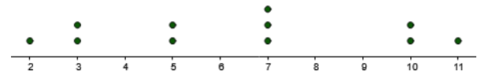

# Review Statistics

## Question 1

Consider the following stem and leaf plot. Find:

a) The 35th percentile

b) The median

| Stem | Leaf |
|------|------|
| 1    | 4 4 6 |
| 2    | 3 8 |
| 3    | 2    |
| 4    | 0 1 |

### a) The 35th percentile

Data: 14, 14, 16, 23, 28, 32, 40, 41

$$ \text{Loc. } P_{35} = \left(\frac{K}{100}\right) \times u = \left(\frac{35}{100}\right) \times 8 = 2.8 \rightarrow 3 $$
$$ P_{35} = 16 \text{ days} $$

### b) The 35th percentile

$$ \text{Loc. } \tilde{x} = \frac{n+1}{2} = \frac{8+1}{2} = 4.5 $$
$$ \tilde{x} = \frac{23 + 28}{2} = 25.5 \text{ days} $$

## Question 2

The following dot plot represents number of books college students read over a semester.

Find the following:

a) The mean

b) The standard deviation

c) The interquartile range

### a) The mean

Data: 2,3,3,5,5,7,7,7,10,10,11

$$ \bar{x} = \frac{\sum{x}}{n} = \frac{2+3+3+5+5+7+7+7+10+10+11}{11} \approx 6.4 $$

### b) The standard deviation

$$
\begin{align}
s &= \sqrt{\dfrac{\sum\limits_{i=1}^{n} (x_i - \bar{x})^2}{n-1}} \\
&= \sqrt{\dfrac{(2 - 6.4)^2 + (3 - 6.4)^2 + (3 - 6.4)^2 + (5 - 6.4)^2 + (5 - 6.4)^2 + (7 - 6.4)^2 + (7 - 6.4)^2 + (7 - 6.4)^2 + (10 - 6.4)^2 + (10 - 6.4)^2 + (11 - 6.4)^2}{11-1}} \\
&\approx 3.1
\end{align}
$$

### c) The interquartile range

$$
\frac{25}{100} \times 11 = 2.75 \rightarrow \text{Loc} P_{25} = 3 \rightarrow P_{25} = 3 \rightarrow Q_1 = 3
$$

$$
\frac{75}{100} \times 14 = 8.25 \rightarrow \text{Loc} P_{75} = 9 \rightarrow P_{75} = 10 \rightarrow Q_3 = 10
$$

$$ IQR = Q_3 - Q_1 = 10−3=7$$

## Question 3

A survey found that 20% of people believe that they have seen a UFO. Choose a sample of 10 people at random. Find the probability of the following. Round intermediate calculations and final answers to at least three decimal places.

(a) At least 3 people believe that they have seen a UFO

(b) Exactly 2 people think they have seen an UFO

(c) At most 2 people believe that they have seen a UFO

### (a) At least 3 people believe that they have seen a UFO

$$
\begin{align}
P(x \geq 3) &= 1 - [P(0) + P(1) + P(2)] \\
&= 1 - [C_{10}^0 \times 0.20^0 \times 0.80^{10} + C_{10}^1 \times 0.20^1 \times 0.80^9 + C_{10}^2 \times 0.20^2 \times 0.80^8] \\
&\approx 0.3222
\end{align}
$$

### (b) Exactly 2 people think they have seen an UFO

$$ P(x = 2) = C_{10}^2 \times 0.20^2 \times 0.80^8 \approx 0.3020 $$

### (c) At most 2 people believe that they have seen a UFO

$$
\begin{align}
P(x \leq 2) &= P(0) + P(1) + P(2) \\
&= C_{10}^0 \times 0.20^0 \times 0.80^{10} + C_{10}^1 \times 0.20^1 \times 0.80^9 + C_{10}^2 \times 0.20^2 \times 0.80^8 \\
&\approx 0.6778
\end{align}
$$

## Question 4

a) In the standard normal distribution, find the z value that
corresponds to the 78th percentile. Use Cumulative Normal
Distribution Table and enter the answer to 2 decimal places.

b) In order for a student to be accepted to a postgraduate
program, she needs to achieve an entrance exam mark that is
at least at the 40% level of all marks. If the mean of marks for
the entrance exam is known to be 82, with a standard
deviation of 8, what is the minimum mark that she needs to
acquire?

### a)

$$ \alpha = 0.78 \rightarrow Z \approx 0.77 $$

### b)

$$ \alpha = 0.4 \rightarrow Z \approx -0.25 $$

$$ x = \mu + Z\sigma = 82 + (-0.25) \times 8 = 80 $$

## Question 5

An airline knows from experience that the distribution of the number of
suitcases that get lost a day on a certain route is approximately normal
with a mean of 15.7 and a standard deviation of 3.6 . What is the
probability that during a randomly selected day the airline will lose less
than 20 suitcases?

- $\mu = 15.7$
- $\sigma = 3.6$

$$ Z = \frac{X - \mu }{\sigma} = \frac{20 - 15.7}{3.6} = 1.19 $$

$$ P(Z < 1.19) = 0.8830 $$

## Question 6

A survey found that the American family generates an average of 17.2
pounds of glass garbage each year. Assume the standard deviation of the
distribution is 2.5 pounds. Find the probability that the mean of a sample
of 33 families will be between 17.3 and 18.3 pounds.

- $\mu = 17.2$
- $\sigma = 2.5$
- $n = 33$
- $P(17.3 < \bar{x} < 18.3) = ?$

$$ Z_1 = \frac{17.3 - 17.2}{\frac{2.5}{\sqrt{33}}} \approx 0.23 $$

$$ Z_2 = \frac{18.3 - 17.2}{\frac{2.5}{\sqrt{33}}} \approx 2.53 $$

$$ P(0.23 \leq Z \leq 2.53) = P(Z \leq 2.53) - P(Z \leq 0.23) = 0.9943 - 0.5910 = 0.4033 $$

## Question 7

For a random sample of 50 overweight men, the mean of the number of
pounds that they were overweight was 31 lbs. The standard deviation of
the population is 6 pounds.

(a) Find the best point estimate of the mean.

(b) Find the 84% confidence interval of the mean of these pounds.

- $n = 50$
- $\bar{x} = 31$
- $\sigma = 6$
- $1 - \alpha = 0.84$

### (a) Find the best point estimate of the mean

The best point estimate of the mean: 31

### (b) Find the 84% confidence interval of the mean of these pounds

$$ 1 - \alpha = 0.84 \rightarrow Z_{\frac{\alpha}{2}} \approx 1.41 $$

$$ \bar{x} - Z_{\frac{\alpha}{2}} \times \frac{\sigma}{\sqrt{n}} < \mu < \bar{x} + Z_{\frac{\alpha}{2}} \times \frac{\sigma}{\sqrt{n}} $$

$$ 31 - 1.41 \times \frac{6}{\sqrt{50}} < \mu < 31 + 1.41 \times \frac{6}{\sqrt{50}} $$

$$ 29.80 < \mu < 32.20 $$

## Question 8

A sample of 8 adult elephants had an average weight of
11,845 pounds with a standard deviation of 20 pounds. Find
the 99 % confidence interval of the population mean for the
weights of adult elephants. Assume the variable is normally
distributed.

- $n = 8$
- $\bar{x} = 11845$
- $s = 20$
- $1 - \alpha = 0.99$

$$ t_{\frac{\alpha}{2}, df} = t_{0.005, 8 - 1} = 3.499 $$

$$ \bar{x} - t_{\frac{\alpha}{2}, df} \times \frac{s}{\sqrt{n}} < \mu < \bar{x} + t_{\frac{\alpha}{2}, df} \times \frac{s}{\sqrt{n}} $$

$$ 11845 - 3.499 \times \frac{20}{\sqrt{8}} < \mu < 11845 + 3.499 \times \frac{20}{\sqrt{8}} $$

$$ 11820.26 < \mu < 11869.74 $$

## Question 9

A sample 100 patients free of diabetes have their body mass index ($BMI$) measured. 32% of these patients have $BMI \geq 30$ and meet the criteria for
obesity. Generate a 95% confidence interval for
the proportion of patients free of diabetes who
are obese.

- $n = 100$
- $\hat{p} = 0.32$
- $1 - \alpha = 0.95$

$$ 1 - \alpha = 0.95 \rightarrow Z_{\frac{\alpha}{2}} = 1.96 $$

$$ \hat{p} - Z_{\frac{\alpha}{2}} \times \sqrt{\frac{\hat{p}(1-\hat{p})}{n}} < p < \hat{p} + Z_{\frac{\alpha}{2}} \times \sqrt{\frac{\hat{p}(1-\hat{p})}{n}} $$

$$ 0.32 - 1.96 \times \sqrt{\frac{0.32 \times 0.68}{100}} < p < 0.32 + 1.96 \times \sqrt{\frac{0.32 \times 0.68}{100}} $$

$$ 0.2286 < p < 0.4114 $$

## Question 10

A researcher found that a cigarette smoker smokes
on average of 29 cigarettes a day. She feels that the
average is different. She selected a random sample of
12 smokers and found that the mean number of
cigarettes they smoked per day was 27, with a standard
deviation of 2.7.
At 0.10 level of significance, is there enough evidence to
support her claim? Assume that the population is
approximately normally distributed. Use the critical
value method and tables.

- (a) State the hypotheses and identify the claim.
- (b) Find the critical value.
- (c) Compute the test value.
- (d) Make the decision.
- (e) Summarize the results.

### (a) State the hypotheses and identify the claim

- **Null Hypothesis ($H_0$)**: $\mu = 29$
- **Alternative Hypothesis ($H_1$)**: $\mu \neq 29$
- **Claim**: The researcher believes that the average is different from 29.

1. HT: $\mu$
2. Two-tail
3. t test

- $n = 12$
- $\mu = 29$
- $\bar{x} = 27$
- $s = 2.7$
- $\alpha = 0.1$

### (b) Find the critical value

$$ \alpha = 0.10 $$

$$ df = n - 1 = 12 - 1 = 11 $$

$$ t_{\frac{\alpha}{2}, df} = t_{0.1, 11} = \pm 1.796 $$

### (c) Compute the test value

$$ t = \frac{\bar{x} - \mu}{s/\sqrt{n}} = \frac{27 - 29}{2.7/\sqrt{12}} = -2.566 $$

### (d) Make the decision

Reject $H_0$

### (e) Summarize the results

At 10% level of significance, there is enough evidence to support the claim

## Question 11

It is known that the average of cats’
weight is 8.7 lbs with a population standard
deviation of 1.8 lbs.
A researcher thinks the weight of cats is
lower than formerly thought. She tests a
sample of 42 cats and finds a mean of 8.4
lbs.
At 0.08 level of significance, is there enough
evidence to support her claim? Use the
critical value method and tables.

- (a) State the hypotheses and identify the claim.
- (b) Find the critical value.
- (c) Compute the test value.
- (d) Make the decision.
- (e) Draw a conclusion.

### (a) State the hypotheses and identify the claim

- **Null Hypothesis ($H_0$):** $\mu = 8.7$ lbs
- **Alternative Hypothesis ($H_1$):** $\mu < 8.7$ lbs
- **Claim:** The researcher believes that the weight of cats is lower than 8.7 lbs.

1. HT: $\mu$
2. Left-tail
3. Z test

- $n = 42$
- $\mu = 8.7$ lbs
- $\bar{x} = 8.4$ lbs
- $\sigma = 1.8$ lbs
- $\alpha = 0.08$

### (b) Find the critical value

$$ \alpha = 0.08 \rightarrow Z_{\alpha} = -1.41 $$

### (c) Compute the test value

$$ Z = \frac{\bar{x} - \mu}{\frac{\sigma}{\sqrt{n}}} = \frac{8.4 - 8.7}{\frac{1.8}{\sqrt{42}}} \approx -1.08 $$

### (d) Make the decision

Fail to reject $H_0$

### (e) Draw a conclusion

At 0.08 level of significance, we dit not find enough evidence to support the claim.

## Question 12

A teacher believes that 85% of students in the class
will want to go on a field trip to the local zoo. She
performs a hypothesis test to determine if the
percentage is different . The teacher samples 50
students and 39 reply that they would want to go to
the zoo. For the hypothesis test, use a 1% level of
significance.

- $p = 0.85$
- $n = 50$
- $x = 39$
- $\alpha = 0.01$

1. HT: $p$
2. Two-tailed
3. Z test

- $H_0$ $p = 0.85$
- $H_1$ $p \neq 0.85$
- Claim: The teacher believes that 85% of students in the class
will want to go on a field trip to the local zoo.

$$ \alpha = 0.01 \rightarrow Z_{\frac{\alpha}{2}} = \pm 2.58 $$

$$ \hat{p} = \frac{x}{n} = \frac{39}{50} = 0.78 $$

$$ Z = \frac{\hat{p} - p}{\sqrt{\frac{p(1-p)}{n}}} = \frac{0.78 - 0.85}{\sqrt{\frac{0.85 \times 0.15}{50}}} = -1.39 $$

Fail to reject $H_0$

At 1% level of significance, there is not enough evidence to support the claim.

## Question 13

A manufacturing company produces shampoo
bottle with a mean weight of 330 g. Due to
problems with the machines on the production
line, the quality control department wishes to
test if the weight has increased (the shampoo
bottles are overfilled). The collect a sample of 22
bottles and finds a mean weight of 350 g with a
standard deviation of 27 g. Test the hypothesis at
5% level of significance.

### (a) State the hypotheses and identify the claim

- $H_0$: $\mu = 330$
- $H_1$: $\mu > 330$
- **Claim:** The quality control department suspects that the mean weight has increased, so their claim aligns with the alternative hypothesis.

1. HT: $\mu$
2. Right-tail
3. t-test

- $n = 22$
- $\mu = 330$
- $\bar{x} = 350$
- $\sigma = 27$
- $\alpha = 0.05$

### (b) Find the critical value

$$ \alpha = 0.05 $$

$$ df = n - 1 = 22 - 1 = 21 $$

$$ t_{\alpha, df} = t_{0.05, 21} = 1.721 $$

### (c) Compute the test statistic (z-value)

$$ t = \frac{\bar{x} - \mu}{\frac{s}{\sqrt{n}}} = \frac{350 - 330}{\frac{27}{\sqrt{22}}} \approx 3.47 $$

### (d) Make the decision

Reject $H_0$

### (e) Draw a conclusion

At 5% level of significance, there is enough evidence to support the claim.

## Question 14

Given the following
sums for a bivariate set of
data, where x represents
the practice questions
solved by 5 students for
test preparation and y
represents the grade
received by the students on
the test, find:

- A) The slope and the y intercept
- B) Estimate the grade obtained by a student who practiced on 10 questions.

| Sum of x | Sum of y | Sum of xy | Sum of x² |
|----------|----------|-----------|-----------|
| 65       | 400      | 5538      | 1071      |

### A) The slope and the y intercept

$$ m = \frac{n(\sum xy) - (\sum x)(\sum y)}{n(\sum x^2) - (\sum x)^2} = \frac{5 \times 5538 - 65 \times 400}{5 \times 1071 - 65^2} $$

$$ m \approx 1.5 $$

$$ b = \bar{y} - m  \bar{x} = \frac{400}{5} - m \times \frac{65}{5} \approx 60.6 $$

$$ \hat{y} = mx + b = 1.5x + 60.6 $$

### B) Estimate the grade obtained by a student who practiced on 10 questions

$$ \hat{y}_{10} = 1.5 \times 10 + 60.6 = 75.6 $$

## Question 16

Consider the probability
distribution shown in the
table below:

a) Find the mean

b) Find the standard deviation

| x | P(x) |
|---|------|
| 0 | 0.20 |
| 1 | 0.15 |
| 2 | 0.35 |
| 3 | 0.30 |
| **Total** | **1** |

### a) Find the mean

$$ \mu = 0 \times 0.20 + 1 \times 0.15 + 2 \times 0.35 + 3 \times 0.30 = 1.75 $$

### b) Find the standard deviation

$$ V = \sqrt{(0^2 \times 0.20 + 1^2 \times 0.15 + 2^2 \times 0.35 + 3^2 \times 0.30) - 1.75^2} \approx 1.09 $$
