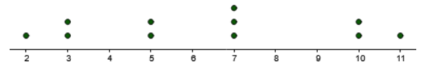

# Review Statistics

## Question 1

Consider the following stem and leaf plot. Find:

a) The 35th percentile

b) The median

| Stem | Leaf |
|------|------|
| 1    | 4 4 6 |
| 2    | 3 8 |
| 3    | 2    |
| 4    | 0 1 |

### a) The 35th percentile

Sort: 14, 14, 16, 23, 28, 32, 40, 41

$$ \text{Loc. } P_{35} = \left(\frac{K}{100}\right) \times u = \left(\frac{35}{100}\right) \times 8 = 2.8 \rightarrow 3 $$
$$ P_{35} = 16 \text{ days} $$

### b) The 35th percentile

$$ \text{Loc. } \tilde{x} = \frac{n+1}{2} = \frac{8+1}{2} = 4.5 $$
$$ \tilde{x} = \frac{23 + 28}{2} = 25.5 \text{ days} $$

## Question 2

The following dot plot represents number of books college students read over a semester.

Find the following:

a) The mean

b) The standard deviation

c) The interquartile range

### a) The mean

Data: 2,3,3,5,5,7,7,7,10,10,11

$$ \bar{x} = \frac{\sum{x}}{n} = \frac{2+3+3+5+5+7+7+7+10+10+11}{11} \approx 6.4 $$

### b) The standard deviation

$$
\begin{align}
s &= \sqrt{\dfrac{\sum\limits_{i=1}^{n} (x_i - \bar{x})^2}{n-1}} \\
&= \sqrt{\dfrac{(2 - 6.4)^2 + (3 - 6.4)^2 + (3 - 6.4)^2 + (5 - 6.4)^2 + (5 - 6.4)^2 + (7 - 6.4)^2 + (7 - 6.4)^2 + (7 - 6.4)^2 + (10 - 6.4)^2 + (10 - 6.4)^2 + (11 - 6.4)^2}{11-1}} \\
&\approx 3.1
\end{align}
$$

### c) The interquartile range

$$
\frac{25}{100} \times 11 = 2.75 \rightarrow \text{Loc} P_{25} = 3 \rightarrow P_{25} = 3 \rightarrow Q_1 = 3
$$

$$
\frac{75}{100} \times 14 = 8.25 \rightarrow \text{Loc} P_{75} = 9 \rightarrow P_{75} = 10 \rightarrow Q_3 = 10
$$

$$ IQR = Q_3 - Q_1 = 10−3=7$$

## Question 3

A survey found that 20% of people believe that they have seen a UFO. Choose a sample of 10 people at random. Find the probability of the following. Round intermediate calculations and final answers to at least three decimal places.

(a) At least 3 people believe that they have seen a UFO

(b) Exactly 2 people think they have seen an UFO

(c) At most 2 people believe that they have seen a UFO

### (a) At least 3 people believe that they have seen a UFO

$$
\begin{align}
P(x \geq 3) &= 1 - [P(0) + P(1) + P(2)] \\
&= 1 - [C_{10}^0 \times 0.20^0 \times 0.80^{10} + C_{10}^1 \times 0.20^1 \times 0.80^9 + C_{10}^2 \times 0.20^2 \times 0.80^8] \\
&\approx 0.3222
\end{align}
$$

### (b) Exactly 2 people think they have seen an UFO

$$ P(x = 2) = C_{10}^2 \times 0.20^2 \times 0.80^8 \approx 0.3020 $$

### (c) At most 2 people believe that they have seen a UFO

$$
\begin{align}
P(x \leq 2) &= P(0) + P(1) + P(2) \\
&= C_{10}^0 \times 0.20^0 \times 0.80^{10} + C_{10}^1 \times 0.20^1 \times 0.80^9 + C_{10}^2 \times 0.20^2 \times 0.80^8 \\
&\approx 0.6778
\end{align}
$$

## Question 4

a) In the standard normal distribution, find the z value that
corresponds to the 78th percentile. Use Cumulative Normal
Distribution Table and enter the answer to 2 decimal places.

b) In order for a student to be accepted to a postgraduate
program, she needs to achieve an entrance exam mark that is
at least at the 40% level of all marks. If the mean of marks for
the entrance exam is known to be 82, with a standard
deviation of 8, what is the minimum mark that she needs to
acquire?

### a)

$$ \alpha = 0.78 \rightarrow z \approx 0.77 $$

### b)

$$ \alpha = 0.4 \rightarrow z \approx -0.25 $$

$$ x = \mu + z\sigma = 82 + (-0.25) \times 8 = 80 $$

## Question 5

An airline knows from experience that the distribution of the number of
suitcases that get lost a day on a certain route is approximately normal
with a mean of 15.7 and a standard deviation of 3.6 . What is the
probability that during a randomly selected day the airline will lose less
than 20 suitcases?

- $\mu = 15.7$
- $\sigma = 3.6$

$$ Z = \frac{X - \mu }{\sigma} = \frac{20 - 15.7}{3.6} = 1.19 $$

$$ P(Z < 1.19) = 0.8830 $$

## Question 6

A survey found that the American family generates an average of 17.2
pounds of glass garbage each year. Assume the standard deviation of the
distribution is 2.5 pounds. Find the probability that the mean of a sample
of 33 families will be between 17.3 and 18.3 pounds.

- $\mu = 17.2$
- $\sigma = 2.5$
- $n = 33$
- $P(17.3 < \bar{x} < 18.3) = ?$

$$ Z_1 = \frac{17.3 - 17.2}{\frac{2.5}{\sqrt{33}}} \approx 0.23 $$

$$ Z_2 = \frac{18.3 - 17.2}{\frac{2.5}{\sqrt{33}}} \approx 2.53 $$

$$ P(0.23 \leq Z \leq 2.53) = P(Z \leq 2.53) - P(Z \leq 0.23) = 0.9943 - 0.5910 = 0.4033 $$

## Question 7

For a random sample of 50 overweight men, the mean of the number of
pounds that they were overweight was 31 lbs. The standard deviation of
the population is 6 pounds.

(a) Find the best point estimate of the mean.

(b) Find the 84% confidence interval of the mean of these pounds.

- $n = 50$
- $\bar{x} = 31$
- $\sigma = 6$
- $1 - \alpha = 0.84$

### (a) Find the best point estimate of the mean

The best point estimate of the mean: 31

### (b) Find the 84% confidence interval of the mean of these pounds

$$ 1 - \alpha = 0.84 \rightarrow z_{\frac{\alpha}{2}} \approx 1.41 $$

$$ 31 - 1.41 \times \frac{6}{\sqrt{50}} < \mu < 31 + 1.41 \times \frac{6}{\sqrt{50}} $$

$$ 29.80 < \mu < 32.20 $$
